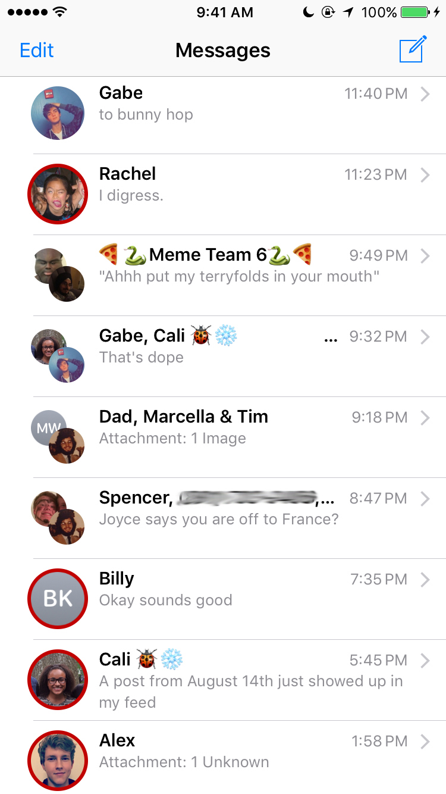

#  Mercury

Mercury is a Cydia tweak that adds a customizable indicator to messages that you haven't responded to.  I've been using it personally for a bit over a year now, so figured it was time to polish it up a little and release it.  I developed a less fully-featured Mac version as well, which you can download/install using SIMBL (described in [this repo](https://github.com/dado3212/message-indicator)).

### What It Looks Like

  

  <video src="screenshots/settings-silent.m4v" height="300"></video>

### Installation

To install it, either install from the .deb in this repo, or add the repository http://cydia.alexbeals.com to Cydia and download Mercury.

### Modification

To start modifying it, simply copy the full folder in, and then symlink folders called 'theos' to $(THEOS) in both the preferences folder and the main folder.  You can create and install the tweak using 'make package install'.

You'll also need a custom set of `include` files in the $(THEOS) directory.  You can find that in the theos-headers repo.

---

<ul>
  <li>
  Objective-C
  <ul>
  <li>THEOS</li>
  </ul>
  </li>
  <li>
  Libraries
  <ul>
  <li><a href="https://github.com/atomikpanda/libcolorpicker">libcolorpicker</a></li>
  </ul>
  </li>
</ul>

**Created by Alex Beals © 2017**
